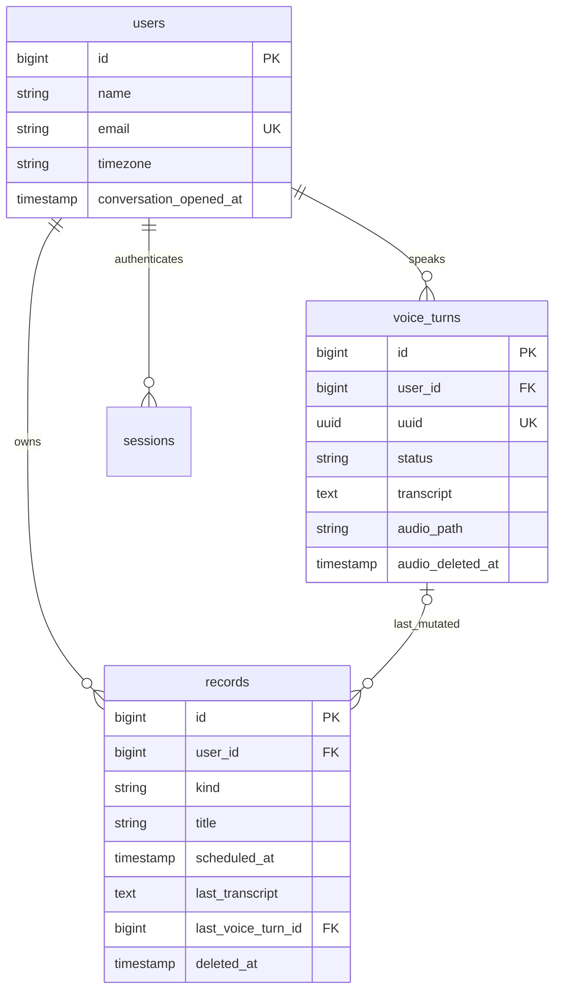

# Database Schema

## 1. Overview

Rafael is a single-user personal secretary. The user signs in, Rafael speaks first, and the durable product memory is **structured records** plus **transcripts of the spoken turns that created or changed them**. Audio files are temporary. Rafael’s spoken replies are session output, not stored audio.

The schema has three layers:

| Layer | Role |
|---|---|
| **Identity and session** | One login (`users`) plus Laravel session/password-reset tables. |
| **Books** | One table of records (`records`): each row is an appointment or a task. Type can change; the single datetime column changes meaning with the type. |
| **Speech pipeline** | One table of user voice turns (`voice_turns`): upload, queued transcription, transcript text, then deletion of the audio file. |

Runtime split: **sessions stay in SQL** (`SESSION_DRIVER=database`) so login and the Livewire yes-draft survive a Redis flush. **Cache and the queue use Redis** (`CACHE_STORE=redis`, `QUEUE_CONNECTION=redis`, `REDIS_CLIENT=phpredis`). Failed jobs still land in SQL (`failed_jobs`). Laravel’s `jobs`, `job_batches`, `cache`, and `cache_locks` tables remain in the default migrations but are **not** the v1 runtime path. Redis is an external process (default `127.0.0.1:6379`); this repo does not ship Compose for it. **The application database is MySQL** (`DB_CONNECTION=mysql` in `.env.example`). The Pest suite uses SQLite `:memory:` via `phpunit.xml` for speed; migrations must stay valid on both. The Pest suite uses `array` cache, `sync` queue, and `array` sessions and does not need Redis.

v1 does **not** model away-from-app notifications, completion, snooze, recurrence, calendar export, sharing, or extra users. Those are documented as later work so this schema is not padded with unused tables.

---

## 2. Design Principles

### Naming

- Plural `snake_case` table names.
- `id` bigint unsigned primary key on application tables.
- Foreign keys named `{model}_id`.
- Eloquent-friendly `foreignId()->constrained()` relationships.

### Database engine

- **Runtime:** MySQL (`.env.example` sets `DB_CONNECTION=mysql`). Sessions, users, records, voice turns, and `failed_jobs` live here.
- **Tests:** Pest uses SQLite `:memory:` through `phpunit.xml`. Keep migrations compatible with both drivers.
- **Foreign keys:** declare every relationship in migrations so MySQL and SQLite both enforce restrict, null-on-delete, and cascade-on-update.

### Referential integrity

- Database foreign keys are required.
- The single user is not deleted in v1. Child rows use `restrictOnDelete()` toward `users` so an accidental user delete cannot silently wipe the books.
- `records.last_voice_turn_id` uses `nullOnDelete()` so old voice turns can be pruned without blocking the record.

### Normalization

- Appointments and tasks are **one table**, not two. The product treats them as the same record whose type can flip; splitting tables would force a row move on every type change.
- Conversation UI state (the proposal waiting for a spoken yes, the current secretary utterance) is **not** a table. Livewire/session owns that draft. Only facts that must survive a process restart are persisted: the user, the books, and in-flight/completed transcriptions.
- Structured meaning (kind, time, title) lives in columns, not JSON.

### Timestamps

- Application tables use `created_at` and `updated_at`.
- Domain datetimes that represent the user’s calendar (`scheduled_at`, `conversation_opened_at`) are stored as UTC and interpreted in `users.timezone`.

### Soft deletes

- `records` uses `softDeletes()`. A removal (US-09) sets `deleted_at`. Soft-deleted rows are off the books: they are not recited as missed, not listed as today’s appointments, and not used to answer questions.
- `users` and `voice_turns` are not soft-deleted in v1.

### Monetary fields

- None. The product has no money.

### Enum and status handling

- Small closed vocabularies use PHP backed string enums and `string` columns (readable in dumps and logs).
- Do not use integer enums unless a later requirement forces it.

### Indexing

- Index what briefing, matching, and the transcription worker actually filter and sort on.
- Do not unique-index titles: duplicate titles are expected (US-10).

### Multi-tenancy

- **None.** One person, one login, no sharing.
- `user_id` still lives on owned rows so “these records are mine” is enforceable in queries and so a later extra-user phase does not require rewriting the books. There is no tenant table, no organization, no RLS policy.

### Cache, queue, and sessions

- Cache: Redis.
- Queue: Redis. Transcription jobs are Redis payloads; results persist on `voice_turns`. If a job runs after its `voice_turns` row was pruned, it **no-ops**.
- Failed jobs: SQL `failed_jobs` (Laravel default with the Redis queue driver).
- Sessions: SQL `sessions`. Do not put cache or queue on the session connection.
- The PHP Redis extension (`ext-redis`) is required; `predis` is not used.

### Audit and history

- The product requires the **raw transcript of the turn that created or changed** the record. That is stored on the record (`last_transcript`) and optionally linked to the originating `voice_turns` row.
- Full revision history of title/time/kind is **not** required for v1. `updated_at` plus the latest transcript are enough.
- Removed records are retained via soft delete, not via a separate audit log table.
- `voice_turns` are an operational log with a **7-day** hard-delete retention (all statuses). After prune, `last_voice_turn_id` is null; `last_transcript` on the record remains.

### Audio

- Raw audio is a filesystem object, not a blob column. The path is stored only until the file is deleted. Raw audio must stay out of backups by default (product rule); that is an operations concern, not a second table.

---

## 3. Assumptions

Confirmed by README, product, project description, and user stories (not assumptions):

- One user, no public signup, authenticated conversation / records / audio upload.
- Appointment: title + start time. Task: title + optional due date.
- Type can flip; the time changes role; a task without a due date cannot become an appointment until a start time exists.
- Create / change / remove persist only after a spoken yes.
- First visit is a greeting; later visits brief today’s appointments and missed (unremoved, start before today) appointments.
- A day is the user’s local calendar day.
- Audio is transcribed then deleted; replies are not kept as audio.
- Away-from-app reminders, complete, snooze, recurrence, search, extra users, and calendar export are after v1.

Closed product/architecture decisions (no longer open):

- `scheduled_at` is a UTC datetime. If the user names only a date, store midnight in `users.timezone`, then convert to UTC.
- `users.timezone` is seeded as `America/Sao_Paulo` and is **not** updated from the browser in v1.
- Record removal is **soft delete**.
- Yes-drafts live in the SQL session (Livewire). A table so a proposal survives refresh is a **future** feature.
- Password reset / treating email as a real mailbox is a **future** feature. Keep `password_reset_tokens`; do not build the flow in v1.
- Hard-delete every `voice_turns` row with `created_at` older than **7 days**, including in-flight. A transcription job whose turn is gone **no-ops**.

Remaining architectural notes (still needed for the schema, not open product questions):

| ID | Note | Why it is needed |
|---|---|---|
| A1 | Appointments and tasks share `records` with `kind` + one `scheduled_at` datetime. | Type flip would be destructive across two tables. |
| A4 | First visit is detected with `users.conversation_opened_at` (null = never opened the conversation). | Must survive new browsers and new sessions. |
| A7 | `voice_turns` persists the click-to-talk pipeline because transcription is server-side and may be queued (Redis). | Job payloads alone are a poor place for status the UI must poll. |
| A8 | Rafael’s reply **text** is not stored. | Only user transcripts and records are product memory. |
| A9 | `last_transcript` on a record is the user utterance that described the create/change, not the word “sim”. | The product wants the turn that created or changed the record. |
| A10 | Questions that do not mutate the books still create `voice_turns` rows (transcript for that ask). They do not create records. | Same upload/transcribe/delete path as mutations. |
| A11 | No `roles`, `permissions`, `notifications`, or `revisions` tables in v1. | Out of documented v1 scope. |
| A12 | Laravel `email_verified_at` remains on `users` but is unused. No MustVerifyEmail. | Avoid fighting the default User model; the product never mentions verification. |
| A14 | Runtime database is MySQL; Pest uses SQLite `:memory:` in `phpunit.xml`. Migrations must work on both. | Confirmed for this project. |
| A15 | Seeding the account is an application/ops concern, not a schema table. | `DatabaseSeeder` reads `ADMIN_*` env via `config('rafael.admin')` and fails if any value is missing. Login uses `Auth::attempt()` against whatever row exists in `users`. |

---

## 4. Entity Relationship Overview



`password_reset_tokens`, `cache`, `cache_locks`, `jobs`, `job_batches`, and `failed_jobs` belong to Laravel and are omitted from the diagram.

There are no many-to-many relationships in v1.

---

## 5. Tables

### `users`

**Purpose**

The only account that can open Rafael. Owns every record and every voice turn. Also stores the two facts the conversation needs that Laravel’s default user does not: **local timezone** (calendar day) and **whether the conversation has ever been opened** (greeting vs briefing).

**Columns**

| Column | Type | Nullable | Default | Description |
|---|---|---:|---|---|
| id | bigint unsigned | No | auto increment | Primary key |
| name | string | No | — | Display name |
| email | string | No | — | Login identifier; unique |
| email_verified_at | timestamp | Yes | null | Laravel default; unused in v1 |
| password | string | No | — | Hashed password |
| remember_token | string(100) | Yes | null | “Remember me” session |
| timezone | string(64) | No | `America/Sao_Paulo` | IANA timezone for “today” and missed appointments. Seeded once; v1 does not change it from the browser |
| conversation_opened_at | timestamp | Yes | null | Set once when the conversation surface is first successfully opened. Null means US-02 (greeting only) |
| created_at | timestamp | No | — | Row created |
| updated_at | timestamp | No | — | Row updated |

**Foreign Keys**

None.

**Indexes**

- Primary key: `id`
- Unique: `email`
- No extra indexes: one row is expected

**Relationships**

- `hasMany` Record
- `hasMany` VoiceTurn
- Laravel: sessions (`user_id`), password reset by email (not an Eloquent relation)

**Business Rules**

- No public registration. Additional rows must not be creatable from the app in v1.
- `conversation_opened_at` is written once; later visits do not clear it.
- `timezone` is set at seed (`America/Sao_Paulo`) and is not overwritten on visit in v1.
- All record and voice-turn queries for the conversation must be scoped to this user even though cardinality is one.

---

### `records`

**Purpose**

The books. Each row is one appointment or one task. This is what Rafael recites, answers questions from, and mutates after a spoken yes.

**Columns**

| Column | Type | Nullable | Default | Description |
|---|---|---:|---|---|
| id | bigint unsigned | No | auto increment | Primary key |
| user_id | bigint unsigned | No | — | Owner; always the sole user in v1 |
| kind | string(32) | No | — | `appointment` or `task` (PHP enum `RecordKind`) |
| title | string(255) | No | — | Spoken/stored title |
| scheduled_at | timestamp | Yes | null | Appointment **start** (UTC), or task **due** (UTC). Null only when `kind = task`. Date-only speech stores midnight in `users.timezone`, then UTC |
| last_transcript | text | No | — | Raw transcript of the user turn that created or last changed this row |
| last_voice_turn_id | bigint unsigned | Yes | null | Voice turn that produced `last_transcript`, if still kept |
| created_at | timestamp | No | — | First saved (after the creating yes) |
| updated_at | timestamp | No | — | Last saved change |
| deleted_at | timestamp | Yes | null | Soft removal (US-09). Null means on the books |

**Foreign Keys**

| Column | References | On delete | On update | Reason |
|---|---|---|---|---|
| user_id | users.id | restrict | cascade | Never orphan the books; do not cascade-delete the only user |
| last_voice_turn_id | voice_turns.id | set null | cascade | Turns may be pruned; the transcript text remains on the record |

**Indexes**

- Primary key: `id`
- Index: `user_id`
- Index: `last_voice_turn_id`
- Composite: `(user_id, kind, deleted_at, scheduled_at)` — briefing (today + missed appointments) and “tasks when asked”
- Index: `(user_id, deleted_at)` — default “on the books” scope
- No unique on `title`

The composite briefing index is the important one: returning visits load appointments where `kind = appointment`, `deleted_at is null`, and `scheduled_at` is either on the local calendar day or strictly before local today. Tasks are `kind = task` and `deleted_at is null`, sorted by `scheduled_at` nulls last when answering US-05.

**Relationships**

- `belongsTo` User
- `belongsTo` VoiceTurn (`lastVoiceTurn`), optional
- User `hasMany` Record

No `belongsToMany`. No morphs.

**Business Rules**

- A row exists only after a spoken yes (US-07). Drafts are not inserted.
- If `kind = appointment`, `scheduled_at` is required.
- If `kind = task`, `scheduled_at` is optional.
- Changing kind (US-08): the same `scheduled_at` value is kept; it is now a due datetime or a start datetime. A task with `scheduled_at` null cannot become an appointment until a start time is supplied (application rule before the yes).
- Titles need not be unique. If more than one on-the-books row matches a change/remove request, Rafael names the matches and waits (US-10). Matching is application logic (title / time), not a unique constraint.
- Soft-deleted rows are excluded from briefing and from answers about the books. They are no longer “missed appointments”.
- Future appointments (`scheduled_at` after the end of local today) stay in the table so questions can mention them; they are not part of the opening briefing.
- An appointment whose start is earlier today still counts as **today**, not missed (US-03).
- Complete, snooze, and recurrence are **not** columns in v1.

**Check constraint (recommended)**

```text
(kind = 'task') OR (kind = 'appointment' AND scheduled_at IS NOT NULL)
```

Enforce in the migration. MySQL 8+ and SQLite both support check constraints when enabled.

---

### `voice_turns`

**Purpose**

One click-to-talk attempt: authenticated upload, queued or inline transcription, transcript text, then deletion of the audio file. This is the operational record for US-04 and the source of `records.last_transcript` when a mutation is confirmed.

It is **not** a chat log of Rafael’s replies and **not** the pending yes-draft (that stays in Livewire until yes).

**Columns**

| Column | Type | Nullable | Default | Description |
|---|---|---:|---|---|
| id | bigint unsigned | No | auto increment | Primary key |
| user_id | bigint unsigned | No | — | Speaker |
| uuid | uuid / char(36) | No | — | Public identifier for upload/status routes; avoid sequential id in URLs |
| status | string(32) | No | `uploaded` | See §7 |
| locale | string(16) | No | `pt-BR` | Transcription language hint |
| disk | string(32) | Yes | null | Filesystem disk while the file exists (e.g. `local`) |
| audio_path | string(255) | Yes | null | Relative path of the upload; null after delete |
| audio_deleted_at | timestamp | Yes | null | When the file was deleted (product: after transcription, or on failure cleanup) |
| transcript | text | Yes | null | Whisper-compatible result; null until completed |
| error_message | string(255) | Yes | null | Safe, user-facing or log-sized failure reason (not a stack trace) |
| duration_ms | unsigned integer | Yes | null | Optional capture length if the client sends it |
| consumed_at | timestamp | Yes | null | When the conversation handled this transcript (answer, propose change, or treat as yes/no) |
| created_at | timestamp | No | — | Upload accepted |
| updated_at | timestamp | No | — | Status changes |

**Foreign Keys**

| Column | References | On delete | On update | Reason |
|---|---|---|---|---|
| user_id | users.id | restrict | cascade | Turns belong to the only user |

Records may point at a turn via `last_voice_turn_id` (see `records`).

**Indexes**

- Primary key: `id`
- Unique: `uuid`
- Index: `user_id`
- Composite: `(user_id, status, created_at)` — poll latest in-flight turn for the session
- Composite: `(status, created_at)` — worker/sweep of stuck `uploaded` / `transcribing` rows
- Index: `created_at` — 7-day retention prune (`WHERE created_at < now - 7 days`)

**Relationships**

- `belongsTo` User
- `hasMany` Record (as `lastVoiceTurn` inverse; usually 0–1 in practice)

**Business Rules**

- Inserted when authenticated audio upload is accepted, **before** transcription finishes.
- After a successful transcript, delete the file, null `audio_path` / `disk`, set `audio_deleted_at`. The transcript remains.
- Failed transcription still deletes the file when present (do not keep raw audio).
- Client microphone/speaker blocks (US-06) happen **before** insert; they do not require a row.
- A “sim” / “não” confirmation is another voice turn. Application logic interprets it; a “não” must not write `records`.
- **Retention:** hard-delete every row whose `created_at` is older than 7 days, **including** `uploaded` / `transcribing`. `records.last_voice_turn_id` nulls via `nullOnDelete`. The scheduled Artisan prune is specified here and is **not implemented in this documentation pass**.
- A Redis transcription job that runs after its turn was deleted **no-ops** (do not recreate the row).

---

### `sessions`

**Purpose**

Laravel database sessions. Required while `SESSION_DRIVER=database`. Holds the login and, together with Livewire, the in-memory conversation draft.

**Columns**

Laravel default (already migrated):

| Column | Type | Nullable | Default | Description |
|---|---|---:|---|---|
| id | string | No | — | Session id (primary key) |
| user_id | bigint unsigned | Yes | null | Authenticated user |
| ip_address | string(45) | Yes | null | Client address |
| user_agent | text | Yes | null | Client UA |
| payload | longText | No | — | Encrypted/serialized session |
| last_activity | integer | No | — | Unix timestamp; indexed |

**Foreign Keys**

Current migration indexes `user_id` but does **not** declare a foreign key. Leave as Laravel default unless a later hardening pass adds `foreignId` with `nullOnDelete`.

**Indexes**

- Primary key: `id`
- Index: `user_id`
- Index: `last_activity`

**Relationships**

- Logical `belongsTo` User (nullable guest rows unused in this product)

**Business Rules**

- Conversation, records, and audio upload require an authenticated session (US-01).
- Do not treat session payload as the source of truth for the books.

---

### `password_reset_tokens`

**Purpose**

Laravel password reset broker storage.

**Columns**

| Column | Type | Nullable | Default | Description |
|---|---|---:|---|---|
| email | string | No | — | Primary key |
| token | string | No | — | Hashed token |
| created_at | timestamp | Yes | null | Issued at |

**Foreign Keys**

None (email is not a constrained FK in the default migration).

**Indexes**

- Primary key: `email`

**Relationships**

None at the Eloquent layer.

**Business Rules**

- Password reset is a **future** product feature. Keep the table; do not build a public reset page in v1.

---

### `jobs`

**Purpose**

Laravel database queue table. Kept by the default migration. **Unused at runtime** while `QUEUE_CONNECTION=redis`. Whisper-compatible jobs go on Redis.

**Columns**

Laravel default: `id`, `queue`, `payload`, `attempts`, `reserved_at`, `available_at`, `created_at`.

**Foreign Keys**

None.

**Indexes**

- Primary key: `id`
- Index: `queue`

**Relationships**

None. Payload may contain `voice_turns.id` / `uuid`.

**Business Rules**

- Do not enqueue v1 transcription work on this table.
- Job payload (on Redis) must not be the only copy of a transcript. Persist results on `voice_turns`.
- Do not put raw audio bytes in the payload.

---

### `job_batches`

**Purpose**

Laravel job batches. Keep the default table; **unused at runtime** with Redis unless batches are introduced. v1 does not require batching.

**Columns / indexes / keys**

Unchanged from the Laravel 13 migration (`id` string PK, counters, `options`, timestamps as integers).

---

### `failed_jobs`

**Purpose**

Failed queue jobs, including failed transcription. **Still used** with the Redis queue driver.

**Columns**

Laravel default, including unique `uuid`. Existing composite index `(connection, queue, failed_at)`.

**Business Rules**

- Surface a safe failure to the user via `voice_turns.status = failed` and `error_message`, not by reading this table in the UI.

---

### `cache` and `cache_locks`

**Purpose**

Laravel database cache tables. Kept by the default migrations. **Unused at runtime** while `CACHE_STORE=redis`. Not domain data. No Eloquent models.

---

## 6. Pivot Tables

None in v1.

There is no record tagging, no shared access, and no many-to-many between users and records (ownership is `records.user_id`).

`last_voice_turn_id` is a nullable belongsTo, not a pivot.

---

## 7. Statuses and Enums

| Table | Field | Proposed values | Meaning | PHP backed enum | DB storage |
|---|---|---|---|---|---|
| records | kind | `appointment` | Happens at a start time; included in opening briefing when today or missed | Yes (`RecordKind`) | string |
| records | kind | `task` | Something to do; optional due; spoken when asked, not in the opening briefing | Yes (`RecordKind`) | string |
| voice_turns | status | `uploaded` | File accepted; waiting for transcription | Yes (`VoiceTurnStatus`) | string |
| voice_turns | status | `transcribing` | Worker/API in progress | Yes | string |
| voice_turns | status | `completed` | `transcript` set; audio should be gone | Yes | string |
| voice_turns | status | `failed` | Transcription or storage failed; audio should still be deleted | Yes | string |

Soft delete on `records` is **not** an enum. `deleted_at` null vs set is the removed state.

Do **not** add `pending_confirmation` to `records`. Unconfirmed creates must not insert a row.

Livewire-only conversation phases (greeting, briefing, listening, repeating a change, waiting for yes, naming matches) are UI state, not database enums.

---

## 8. Data Integrity Rules

- **Uniqueness:** `users.email`; `voice_turns.uuid`. Record titles are not unique.
- **Tenant ownership:** every `records` and `voice_turns` row has `user_id`. Queries for the conversation always constrain `user_id` to the authenticated user.
- **Users are not deleted** in v1. FKs restrict deleting a user who still has children.
- **Records are soft-deleted** on remove. Hard delete of records is not part of v1 product behavior.
- **Voice turns** are hard-deleted when `created_at` is older than 7 days (all statuses). `last_voice_turn_id` nulls. In-flight turns in that window are deleted; the matching Redis job no-ops if it still runs.
- **Parent-child:** a record cannot belong to another user than its voice turn’s user. Enforce in application when setting `last_voice_turn_id` (same `user_id`).
- **Duplicate prevention:** do not unique-constrain content. US-10 is the duplicate-title UX.
- **Appointment time:** database check + application: appointment ⇒ `scheduled_at` not null.
- **Financial data:** none.
- **Audio:** never treat `audio_path` as durable. After `completed` or `failed`, path is null and `audio_deleted_at` is set.
- **First visit:** `conversation_opened_at` is monotonic (null → timestamp, never back to null).
- **Confirmation:** no `records` insert/update/soft-delete without a completed confirmation in the application workflow.

---

## 9. Index Strategy

| Need | How |
|---|---|
| Login | Unique `users.email` (exists) |
| Opening briefing (US-03) | `(records.user_id, kind, deleted_at, scheduled_at)` plus application conversion of local day bounds to UTC |
| Task questions (US-05) | Same composite; filter `kind = task` and `deleted_at is null` |
| Ambiguous match listing (US-10) | Load on-the-books rows for the user (index `(user_id, deleted_at)`); filter titles in PHP or `LIKE` — a dedicated full-text index is deferred with “search” after v1 |
| Sort by time | `scheduled_at` is the trailing column of the briefing composite |
| Joins | `user_id` on children; `last_voice_turn_id` on records |
| Transcription worker | Redis queue; SQL `(voice_turns.status, created_at)` and unique `uuid` for status polling |
| Voice-turn prune | `voice_turns.created_at` (delete older than 7 days) |
| Sessions | Laravel defaults (SQL) |
| Dashboards / reports | None in v1 |
| Notifications / sync jobs | None in v1 |

Avoid indexes on `title` until search exists. Avoid indexing `last_transcript` (large text).

---

## 10. Suggested Laravel Models

| Table | Model | Notes |
|---|---|---|
| users | User | Extend existing authenticatable; add timezone + conversation_opened_at |
| records | Record | New |
| voice_turns | VoiceTurn | New |
| sessions | — | Laravel session driver; no model |
| password_reset_tokens | — | Framework |
| jobs | — | Framework; unused at runtime (Redis queue) |
| job_batches | — | Framework; unused unless batches are introduced |
| failed_jobs | — | Framework; used with Redis queue |
| cache | — | Framework; unused at runtime (Redis cache) |
| cache_locks | — | Framework; unused at runtime |

Suggested enums (not models): `RecordKind`, `VoiceTurnStatus`.

Do not introduce `Appointment` and `Task` models unless a later STI/subclass choice is made. v1 should use `Record` + `kind`.

---

## 11. Suggested Migration Order

Already present (do not redo unless changing them):

1. `users`, `password_reset_tokens`, `sessions`
2. `cache`, `cache_locks`
3. `jobs`, `job_batches`, `failed_jobs`

Proposed subsequent order:

4. **Alter `users`** — add `timezone`, `conversation_opened_at`
5. **`voice_turns`** — depends on `users`
6. **`records`** — depends on `users` and `voice_turns` (`last_voice_turn_id`)

If `last_voice_turn_id` is added in a follow-up migration, `records` could be created before `voice_turns` without the FK, then altered. Prefer one `records` migration after `voice_turns` so the FK exists from the start.

---

## 12. Existing Implementation vs Proposed Schema

The repo is a Laravel 13 skeleton. Domain schema is partially implemented. Default `APP_LOCALE` may not match the product (pt-BR) but that is not a table conflict.

| Area | Status | Detail |
|---|---|---|
| `users` (name, email, password, remember_token, timestamps) | Already implemented correctly | Keep |
| `users.email_verified_at` | Partially implemented | Column exists; product does not use verification |
| `users.timezone` | Missing | Required for local calendar day |
| `users.conversation_opened_at` | Missing | Required for US-02 vs US-03 |
| `password_reset_tokens` | Already implemented correctly | Framework |
| `sessions` | Already implemented correctly | No FK to users (Laravel default) |
| `cache`, `cache_locks` | Already implemented; unused at runtime | Default migrations kept; `CACHE_STORE=redis` |
| `jobs`, `job_batches` | Already implemented; unused at runtime | Default migrations kept; `QUEUE_CONNECTION=redis` |
| `failed_jobs` | Already implemented correctly | Still used for Redis queue failures |
| `records` | Missing | Entire books domain |
| `voice_turns` | Missing | Entire speech pipeline persistence |
| `app/Models` besides User | Missing | Only `User` exists |
| Enums, actions, DTOs, custom validation, services | Missing | No domain code |
| `UserFactory` / `DatabaseSeeder` | Partially implemented | Factory is generic. Seeder should create one user from `ADMIN_*` via `config('rafael.admin')` and fail when env is incomplete. Login resolves users through the standard guard, not seeder config. |
| Notifications / push tables | Missing (correct) | After v1 |
| Separate `appointments` / `tasks` tables | Missing (correct) | Do not add; they would fight US-08 |
| `composer.json` | Partially implemented | Requires `ext-redis`; no Livewire yet (out of schema scope) |
| Redis cache/queue | Wired in env | Sessions remain database; tests stay array/sync |

Nothing in the current migrations is obsolete for v1. Nothing in the current migrations implements the books.

---

## 13. Open Questions

None that still change this schema. Date-only dues (midnight), soft deletes, seeded timezone, 7-day `voice_turns` prune, job no-op, session-only yes-drafts, and deferred password reset are decided.

Deferred product work (no new tables in v1): durable yes-draft after refresh; password-reset flow; away-from-app notifications; complete / snooze / recurrence / search.

Do not block v1 migrations on Whisper provider, TTS provider, or Web Push.

---

## 14. User Story Coverage

| User Story / Requirement | Tables Involved | Schema Support |
|---|---|---|
| US-01 Log in; only account; conversation/records/upload need session | `users`, `sessions` | Complete (single-user policy is application + seed, not extra tables) |
| US-02 First open is greeting only | `users.conversation_opened_at` | Complete |
| US-03 Today’s appointments + missed unremoved appointments; no future days; no tasks in briefing | `records`, `users.timezone` | Complete |
| US-04 Click to talk; transcribe; delete audio | `voice_turns` + Redis queue; `failed_jobs` on failure; 7-day prune is operational, not a user story | Complete |
| US-05 Ask about tasks (and appointments) from stored data, not the web | `records`, `voice_turns` (the question transcript) | Complete |
| US-06 Mic or speaker blocked, said in words | — (client; no row) | Complete (no schema). Transcription API failure uses `voice_turns.status` |
| US-07 Create appointment (title + start) or task (title, due optional) only after yes | `records`, `voice_turns` | Complete |
| US-08 Change title, time, kind; time changes role; ask for start if task has no due | `records` | Complete |
| US-09 Remove only after yes; removed appointment not recited as missed | `records.deleted_at` | Complete |
| US-10 Multiple matches: name them, do not pick | `records` (non-unique titles) | Complete |
| Spoken yes required; no/silence leaves books unchanged | Livewire/SQL session + write path; `records` has no draft status | Complete |
| One user, no signup, no sharing | `users` + no tenant/share tables | Complete |
| Shared record fields: title, created at, transcript of creating/changing turn | `records.title`, `created_at`, `last_transcript` | Complete |
| Audio is not memory; replies not stored as audio | `voice_turns` path cleared; no reply-audio table | Complete |
| Local calendar day | `users.timezone` (seeded, not browser) + UTC `scheduled_at` (midnight if date-only) | Complete |
| After v1: notifications | — | Requires clarification later (no table now) |
| After v1: complete, snooze, recurrence, search | `records` (future columns/indexes) | Partial (intentionally omitted) |
| After v1: extra users | `user_id` already present | Partial (no signup/roles) |

Every v1 story has a place to put the data it needs. The only deliberate gaps are post-v1 verbs and away-from-app reminders.
